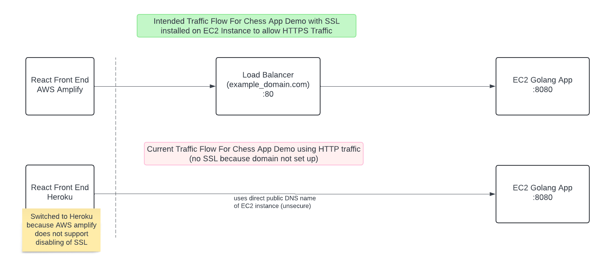

This is the backend server for the Domain challenge written in GOLANG and using the GIN framework for the REST API.

API Operations
GET
  - /new
    -  creates a new game with an incremental ID (larger than the last ID in the mongoDB collection), and returns the data
      -   returns ChessGame object
    - 200 status on success
    - 500 status if unable to generate
  - /live/{id}
    - finds a game by the specified ID value, and returns the data 
      -  returns ChessGame object  
    -  200 status on success (both active and inactive games found by the id) 
    -  400  status on bad id request
    -  404 status if id cannot be found in mongoDB collection
    -  500 status for other
   
POST
  - /live/{id}
    - accepts body of type ChessGame
    - finds  the corresponding ChessGame document in mongoDB collection using ID parameter, and udpates the document with the PGN supplied in the ChessGame request body
    - 200 status on success
    - 400 status on bad request
    - 500 status on other

DELETE
  - /end/{id}/{endingPlayerColor}
    - returns EndGameResponse object  
    - finds the game specified by the ID, removes the document from the mongoDB collection, creates a response indicating that the game ended naturally (via win/lose/draw) and returns it
    - 200 status on success
    - 400 status on bad request
    - 500 status on other
 - /quit/{id}/{endingPlayerColor}
    - returns EndGameResponse object  
    - finds the game specified by the ID, removes the document from the mongoDB collection, creates a response indicating that the game ended by request from one of the players, and returns it
    - 200 status on success
    - 400 status on bad request
    - 500 status on other
  

Data Types
type ChessGame struct {
	ID          uint64 `bson: "id"`
	PGN         string `bson: "pgn"`
	CurrentTurn string `bson: "currentTurn"`
	IsGameLive  bool   `bson: "isGameLive"`
}

type EndGameResponse struct {
	Success        bool   `json: "success"`
	IsQuit         bool   `json:"isQuit "`
	EndingPlayer   string `json: "endingPlayer"`
	FailureMessage string `json: "failureMessage"`
}

Compiled on amazon EC2 server using go version 1.20 (despite the commit message on most of the server code)

